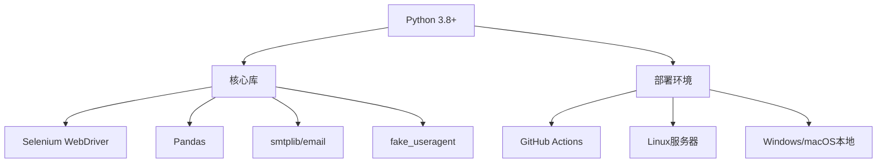

# 招聘信息自动化爬取系统


这是一个专门为毕业生设计的自动化招聘信息爬取系统，帮助用户应对秋招、春招以及实习等求职场景。系统定时爬取付费招聘网站的最新信息，自动过滤过期职位，并通过邮件发送更新报告和完整数据文件。

**📌 核心功能**

**🕷️ 智能爬取引擎**
- 使用Selenium模拟真实浏览器行为
- 随机User-Agent和会话管理避免反爬
- 分页爬取策略（每次会话最多2页）
- 随机等待时间模拟人类操作模式
- 无头模式支持（适合服务器部署）

 **📊 数据处理系统**
- JSON格式存储历史数据
- Excel格式导出完整职位信息
- 自动对比新旧数据识别更新
- 基于截止日期清理过期职位
- 结构化存储招聘关键信息

**📧 自动邮件通知**
- HTML格式的视觉化报告
- 新增/更新职位醒目标记
- 统计摘要（总数/新增/更新/过期）
- 附带Excel数据文件附件
- 支持QQ邮箱（可配置其他SMTP服务）

**🛠️ 技术栈**



**⚙️ 配置指南**

 环境变量设置
1. 创建`.env`文件或在系统环境变量中添加：
```env
EMAIL_USER=your_email@example.com# 发件邮箱
EMAIL_PWD=your_email_password# 邮箱授权码（不是登录密码）
```

 **关键参数配置**
在代码中可调整的参数：
```python
START_PAGE = 1# 起始页码
END_PAGE = 6# 结束页码
MAX_PAGES_PER_SESSION = 2# 单次会话最大爬取页数
SITE_URL = "https://www.givemeoc.com" # 目标网站
WAIT_TIME_MIN = 1# 最小等待时间(秒)
WAIT_TIME_MAX = 3# 最大等待时间(秒)
DATA_FILE = "job_data.json"# 数据存储文件
EXCEL_FILE = "job_data.xlsx"# Excel导出文件
```

**💻 本地运行**

1. 安装依赖：
```bash
pip install selenium pandas fake_useragent openpyxl
```

2. 下载对应ChromeDriver版本：
- 确保Chrome浏览器版本与ChromeDriver匹配
- 将ChromeDriver放在系统PATH或项目目录中

3. 运行主程序：
```bash
python job_crawler.py
```

 **🤖 GitHub Actions自动化部署**

 配置文件 (`.github/workflows/daily_crawler.yml`)
```yaml
name: Daily Job Crawler

on:
schedule:
- cron: '0 20 * * *'# 每天UTC时间20:00运行（北京时间凌晨4:00）
workflow_dispatch:# 支持手动触发

jobs:
crawl:
runs-on: ubuntu-latest
steps:
- uses: actions/checkout@v3
- name: Set up Python
uses: actions/setup-python@v4
with:
python-version: '3.10'
- name: Install dependencies
run: |
sudo apt-get update
sudo apt-get install -y chromium-browser chromium-chromedriver
pip install selenium pandas fake_useragent openpyxl
- name: Run crawler
env:
EMAIL_USER: ${{ secrets.EMAIL_USER }}
EMAIL_PWD: ${{ secrets.EMAIL_PWD }}
run: python job_crawler.py
```

**仓库Secrets配置**
| Secret名称| 描述|
|---------------|-------------------------------|
| EMAIL_USER| 发件邮箱地址|
| EMAIL_PWD| 邮箱授权码（在邮箱设置中生成）|


**📬 邮件包含：**
- 统计摘要面板
- 新增职位列表（绿色高亮）
- 更新职位列表（橙色高亮）
- Excel附件（完整数据）

**📂项目结构**

```
job-crawler/
├── .github/
│└── workflows/
│└── daily_crawler.yml# 定时任务配置
├── src/
│└── job_crawler.py# 主程序
├── .gitignore
├── job_data.json# 历史数据存储
├── job_data.xlsx# Excel数据文件
├── requirements.txt# Python依赖
└── README.md# 项目文档
```

**⚠️ 注意事项**

1. 请遵守目标网站的Robots协议和使用条款
2. 合理设置爬取频率避免给目标网站造成负担
3. 邮箱授权码不同于登录密码，需在邮箱设置中专门生成
4. 定时任务时间需考虑时区差异（GitHub Actions使用UTC时间）

**未来扩展**

- [ ] 支持多招聘网站爬取
- [ ] 添加关键词过滤功能
- [ ] 实现WEB UI控制面板
- [ ] 增加Telegram/企业微信通知
- [ ] 生成求职进度跟踪仪表盘
